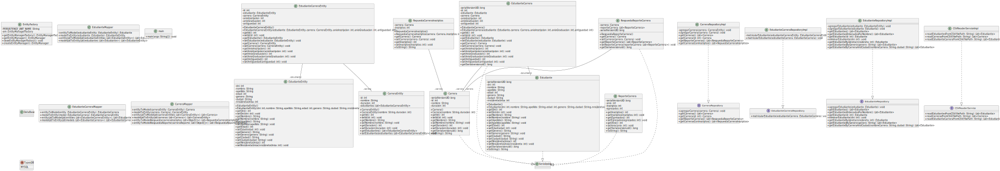

# Arquitecturas Web - Integrador N°2
Arquitecturas Web - Integrador N°2

# Integrantes:
- Juan Schwindt
- Facundo Sanchez
- Jeremías Staldeker
  

# Diagrama de Clases:

# Aclaraciones:
El desarrollo del integrador se realizó en base a Java 1.8.

Se decidió utilizar una base de datos MySQL alojada en un servidor externo. Por lo tanto, la inserción de datos de los archivos CSV puede llevar más tiempo del esperado. Esto podría resolverse utilizando una base de datos local para las pruebas.

La base de datos ya está actualmente poblada, y la sección del código en el main que se encarga de dicha inserción está comentada. Por lo tanto, en caso de desear probar la creación de tablas e inserción de datos, deberán eliminarse dichas tablas o cambiar las credenciales presentes en el archivo "src/META-INF/persistence.xml" para que apunten a una nueva base de datos y descomentar la sección del código.
  
